# SQL Data Warehouse & Analytics Engineering Project

## 📌 Project Overview

This project demonstrates an end-to-end **SQL Data Warehouse and Analytics workflow** built using **SQL Server and T-SQL**.

The project integrates CRM and ERP source data through a **Bronze → Silver → Gold architecture**, transforming raw CSV files into cleaned, structured, analytics-ready datasets.

The final Gold layer supports **customer reporting, product reporting, sales analysis, segmentation, trend analysis, and advanced SQL analytics**.

### End-to-End Workflow

**Raw CRM & ERP Data → Bronze Layer → Silver Layer → Gold Layer → Business Reports → Advanced Analytics**

---

## 🏗️ Data Warehouse Architecture

The warehouse follows a layered approach:

### 🥉 Bronze Layer — Raw Data Ingestion

- Created raw tables for **CRM and ERP datasets**
- Loaded CSV files using **BULK INSERT**
- Developed `bronze.load_bronze` stored procedure
- Used **TRUNCATE + reload** approach for repeatable loading
- Added load-duration tracking
- Organized CRM and ERP source loading separately

### 🥈 Silver Layer — Cleaning & Transformation

- Cleaned and standardized Bronze-layer data
- Applied data quality and transformation logic
- Integrated CRM and ERP datasets
- Loaded transformed records into Silver tables
- Developed `silver.load_silver` stored procedure
- Added execution monitoring for the transformation process

### 🥇 Gold Layer — Analytics Model

Built analytics-ready views using a dimensional structure:

- `gold.dim_customers`
- `gold.dim_products`
- `gold.fact_sales`
- `gold.report_customers`
- `gold.report_product`

The Gold layer provides structured data for **business reporting and advanced analytics**.

---

## 🗂️ Warehouse Structure


The final SQL Server database contains:

- **Bronze tables** for raw CRM and ERP data
- **Silver tables** for cleaned and transformed data
- **Gold dimension and fact views**
- **Customer and product reporting views**
- **Stored procedures** for Bronze and Silver processing

---

## ⚙️ ETL Pipeline

### Bronze Data Loading

The Bronze stored procedure loads source CSV files into SQL Server and tracks the execution of each load.

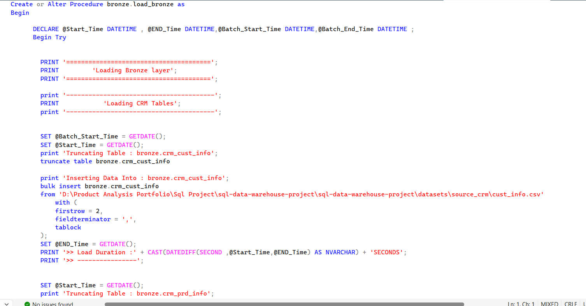


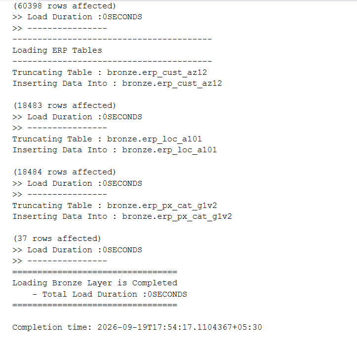

### Silver Transformation

The Silver stored procedure transforms and loads cleaned data from the Bronze layer into analytics-ready Silver tables.


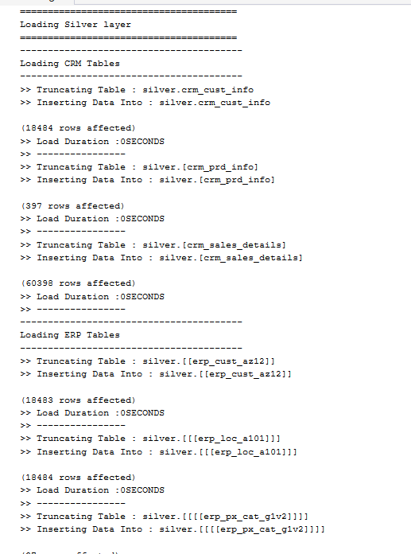

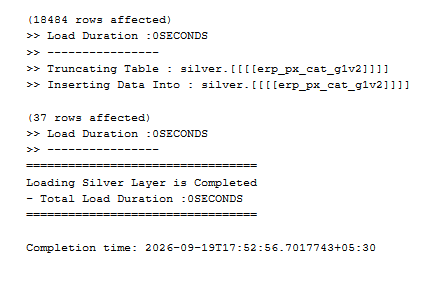

---

## ⭐ Gold Layer — Dimensional Model

The Gold layer transforms cleaned Silver data into business-friendly **dimension and fact views**.

### Dimension Views

- Customer Dimension
- Product Dimension

### Fact View

- Sales Fact


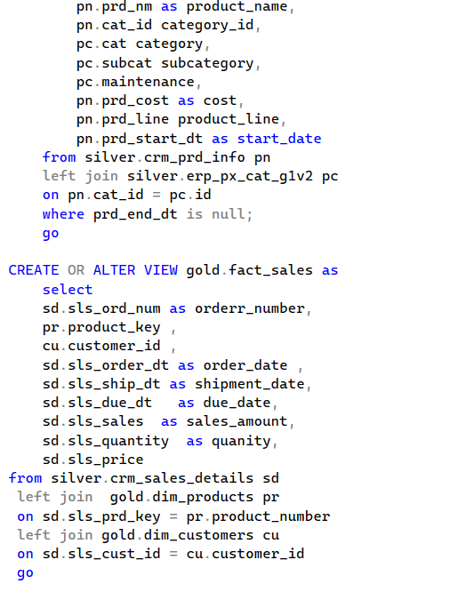

### Gold Layer Output

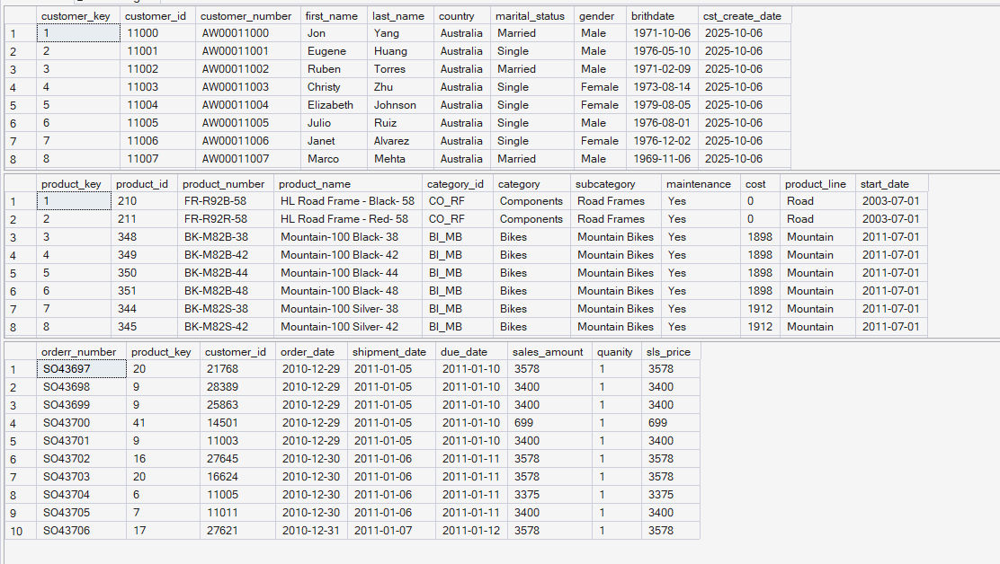

---

## 📊 Business Reporting

Two reporting views were developed:

### Customer Report

The customer report analyzes:

- Customer age
- Age groups
- Customer lifespan
- Recency
- Total orders
- Total sales
- Total quantity
- Products purchased
- Average order value
- Customer segmentation

Customer segments include:

- **VIP**
- **Regular**
- **New**

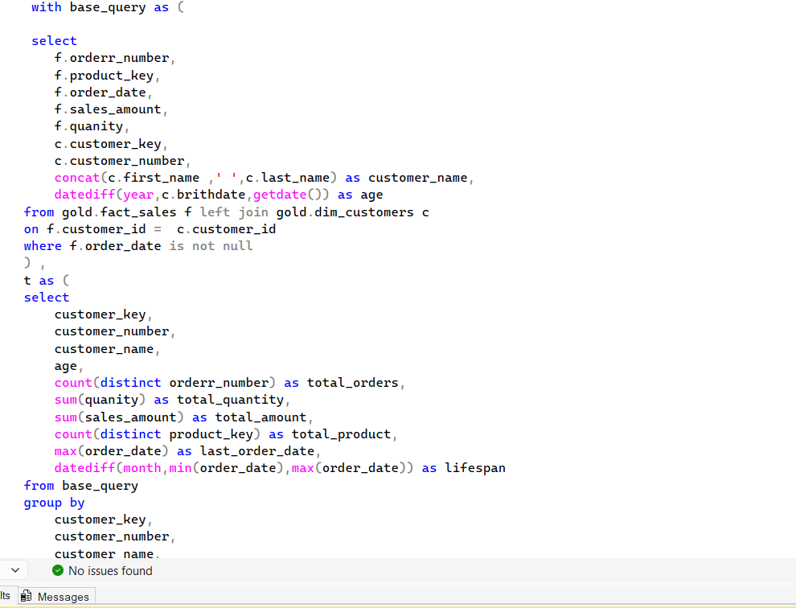


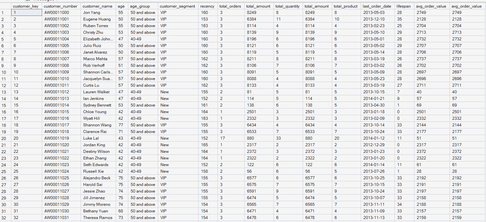

### Product Report

The product reporting layer supports analysis of product-level sales and performance using Gold-layer sales and product data.

---

## 📈 Advanced SQL Analytics

The project also contains advanced analytical queries for exploring sales, customers, and product performance.

### Change Over Time Analysis

Used date-based aggregation to analyze how sales, customers, and quantity changed over time.

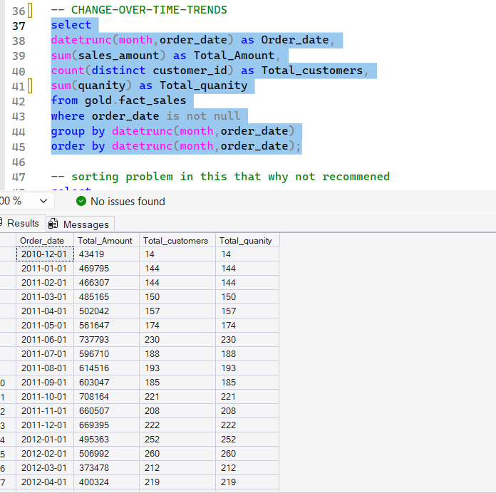

### Cumulative Analysis

Used aggregation and window functions to analyze cumulative business performance.

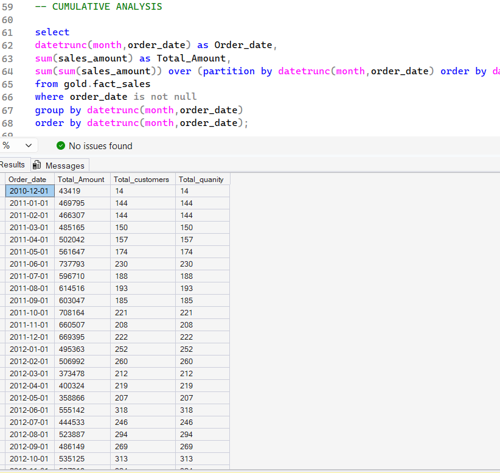

### Running Total Analysis

Used SQL window functions to calculate **running totals and moving averages**.

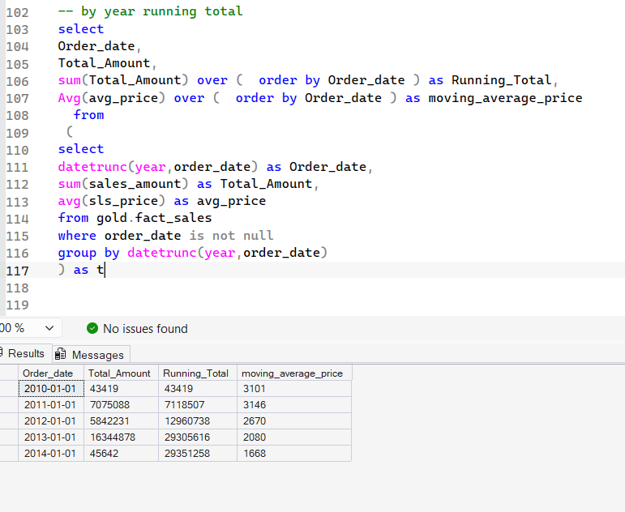

### Product Performance Analysis

Used **CTEs, window functions, averages, LAG, and CASE statements** to compare product performance across different years.


---

## 🔍 SQL Techniques Used

This project demonstrates practical use of:

- SQL Joins
- CTEs
- Window Functions
- `ROW_NUMBER()`
- `LAG()`
- `CASE WHEN`
- Aggregate Functions
- `GROUP BY`
- Date Functions
- Running Totals
- Moving Averages
- Ranking Analysis
- Customer Segmentation
- Change-Over-Time Analysis
- Cumulative Analysis
- Stored Procedures
- `BULK INSERT`
- Data Cleaning
- Data Transformation
- Dimensional Modeling

---

## 🛠️ Technologies Used

| Technology | Purpose |
|---|---|
| **SQL Server** | Database & Data Warehouse |
| **T-SQL** | ETL, transformation & analytics |
| **SSMS** | Database development & execution |
| **CSV** | CRM & ERP source data |
| **Stored Procedures** | ETL workflow automation |
| **Window Functions & CTEs** | Advanced analytics |

---

## 📁 Project Structure

```text
SQL-Data-Warehouse-Analytics/
│
├── README.md
│
├── 01_database_setup.sql
├── 02_bronze_create_tables.sql
├── 03_bronze_load_procedure.sql
├── 04_silver_cleaning_transformation.sql
├── 05_gold_dimensions_fact.sql
├── 06_business_reports.sql
├── 07_advanced_data_analysis.sql
│
└── screenshots/
    ├── 01_data_warehouse_architecture.png
    ├── 02_bronze_load_procedure.png
    ├── 03_bronze_load_execution_crm.png
    ├── 04_bronze_load_execution_complete.png
    ├── 05_silver_load_procedure.png
    ├── 06_silver_load_execution.png
    ├── 07_silver_load_execution_complete.png
    ├── 08_gold_dimension_views.png
    ├── 09_gold_fact_sales_view.png
    ├── 10_gold_layer_output.png
    ├── 11_customer_report_query.png
    ├── 12_customer_segmentation_logic.png
    ├── 13_customer_report_output.png
    ├── 14_change_over_time_analysis.png
    ├── 15_cumulative_analysis.png
    ├── 16_running_total_analysis.png
    └── 17_product_performance_analysis.png
```

---

## ▶️ SQL Execution Order

Run the SQL files in the following order:

```text
01_database_setup.sql
        ↓
02_bronze_create_tables.sql
        ↓
03_bronze_load_procedure.sql
        ↓
04_silver_cleaning_transformation.sql
        ↓
05_gold_dimensions_fact.sql
        ↓
06_business_reports.sql
        ↓
07_advanced_data_analysis.sql
```

> **Note:** Update the CSV file paths used in the `BULK INSERT` statements according to your local environment before executing the Bronze loading procedure.

---

## 💡 What I Learned

This project helped me understand how different SQL and analytics concepts connect in a complete workflow rather than working with them separately.

I gained hands-on experience with:

**Raw Data → ETL → Data Cleaning → Data Warehouse → Dimensional Modeling → Business Reporting → Advanced Analytics**

It strengthened my understanding of both **Data Engineering and Data Analytics**, especially how raw operational data can be transformed into structured datasets that support business decision-making.

---

## 👤 Author

**Amit Kumar Khushwaha**

**Data Analyst | BI & Reporting | Data Engineering**

GitHub: `Amit-Product-Analytics`