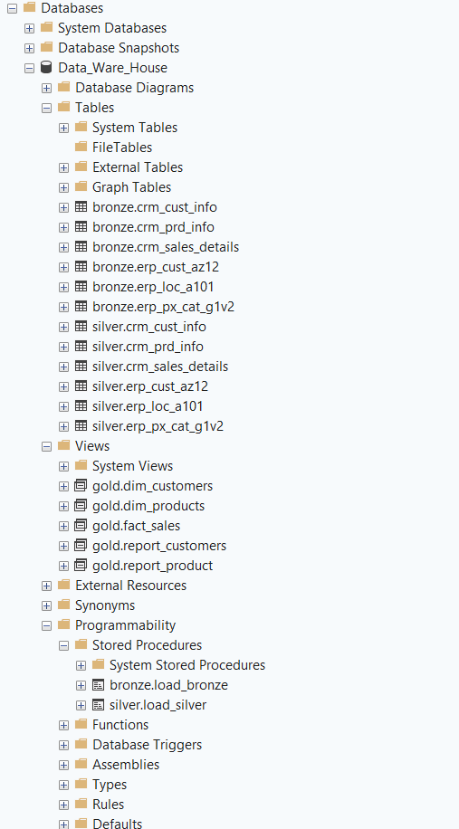
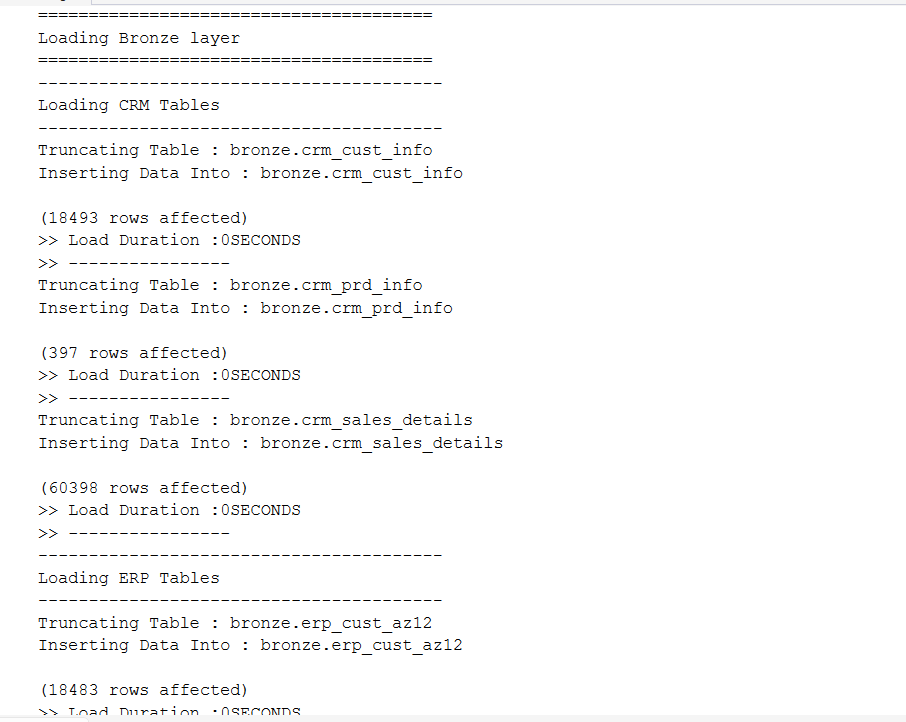
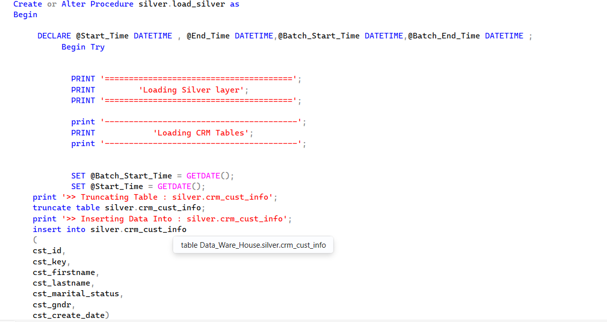
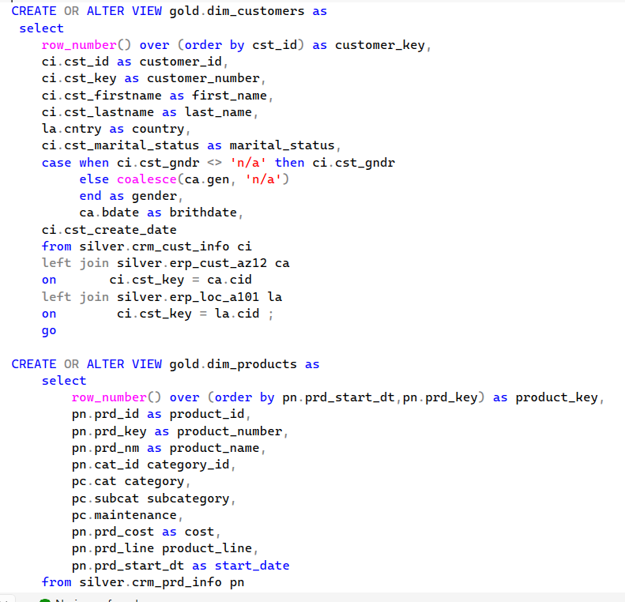
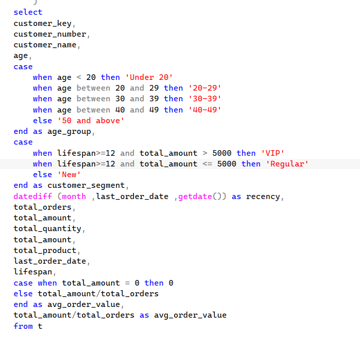
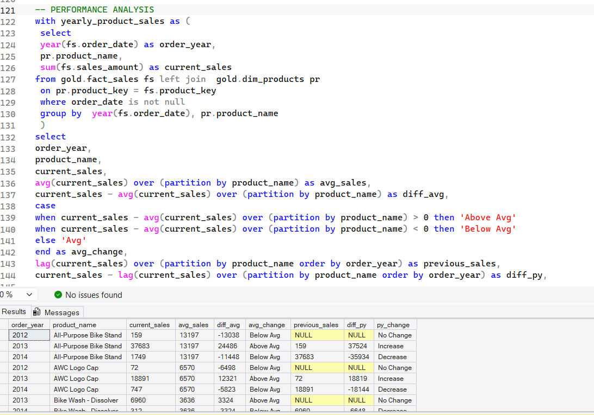

# SQL Data Warehouse & Analytics Project

## Project Overview
End-to-end SQL Data Warehouse project built using SQL Server and SSMS.
The project demonstrates the complete data lifecycle from raw CRM/ERP
data ingestion to transformation, dimensional modeling, business reporting,
and advanced SQL analytics.

## Architecture

Raw CRM & ERP Data
        ↓
Bronze Layer
Raw Data Ingestion
        ↓
Silver Layer
Cleaning & Transformation
        ↓
Gold Layer
Fact & Dimension Model
        ↓
Business Reports
        ↓
Advanced Analytics

## Data Architecture

### Bronze Layer
- Created source tables for CRM and ERP datasets
- Loaded CSV data using BULK INSERT
- Built stored procedure for automated loading
- Used TRUNCATE + reload strategy
- Added execution-time monitoring and error handling

### Silver Layer
- Cleaned and standardized raw data
- Handled data quality issues
- Transformed customer, product and sales data
- Built a stored procedure for Silver-layer processing

### Gold Layer
Created analytics-ready views:

- `gold.dim_customers`
- `gold.dim_products`
- `gold.fact_sales`
- `gold.report_customers`
- `gold.report_product`

## SQL Analytics

Performed advanced business analysis including:

- Change-over-time analysis
- Cumulative analysis
- Running totals
- Moving averages
- Product performance analysis
- Customer segmentation
- Revenue analysis
- Customer behavior analysis

## SQL Techniques Used

- CTEs
- Window Functions
- ROW_NUMBER()
- LAG()
- CASE WHEN
- JOINs
- Aggregate Functions
- Date Functions
- Stored Procedures
- Views
- BULK INSERT
- TRY/CATCH
- Data Quality Checks

## Project Structure

01_database_setup.sql  
02_bronze_create_tables.sql  
03_bronze_load_procedure.sql  
04_silver_cleaning_transformation.sql  
05_gold_dimensions_fact.sql  
06_business_reports.sql  
07_advanced_data_analysis.sql  
screenshots/

## Tools & Technologies

- SQL Server
- SQL Server Management Studio (SSMS)
- T-SQL
- Data Warehousing
- ETL
- Dimensional Modeling
- Medallion Architecture

## Key Learning

This project helped me understand how raw data can move through an
end-to-end data warehouse pipeline — from ingestion and cleaning to
dimensional modeling, reporting and advanced business analysis.

## Project Screenshots

### 1. Data Warehouse Architecture

### 2. Bronze Layer - Automated Data Loading

### 3. Silver Layer - Cleaning & Transformation

### 4. Gold Layer - Dimensional Model

### 5. Customer Segmentation & Reporting

### 6. Product Performance Analysis

